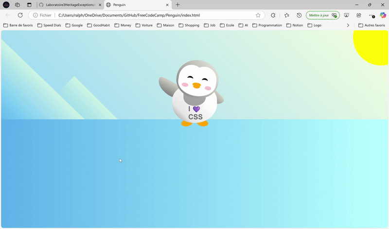

# Penguin
 
🐧 **CSS Animated Penguin**

📌 **Description**
CSS Animated Penguin is a playful web project that demonstrates creative use of HTML and CSS animations to create an interactive, animated penguin character. Ideal for learning and mastering:

- CSS positioning and layering (z-index)
- Keyframe animations (`@keyframes`)
- CSS variables
- Responsive design basics

This project serves as an engaging exercise for beginners and intermediate learners who want to practice advanced CSS animation techniques and element interactions.

🛠️ **Technologies Used**
- **HTML5:** Structure and semantics of the page
- **CSS3:** Styles, positioning, and animations

📂 **Project Structure**
```
/css-penguin-animation
│── index.html
│── styles.css
└── README.md
```

📜 **Files**
1️⃣ `index.html`: Contains the HTML structure of the animated penguin and background elements

2️⃣ `styles.css`: Contains all CSS styles, including animations for waving and nodding

🚀 **Installation and Execution**

1️⃣ **Clone the project**
```bash
git clone https://github.com/your-profile/css-penguin-animation.git
cd css-penguin-animation
```

2️⃣ **Open the file**
- Open `index.html` in your browser to view the animated penguin.

🎯 **Features**
- 🖐️ Animated waving arm using CSS keyframes
- 😄 Head nodding synchronized animation
- 🌄 Creative landscape background with CSS gradients
- 📱 Responsive design and interactive scaling on penguin click

📌 **Project Preview**



🔗 **Example Code**

**HTML:**
```html
<div class="penguin">
  <div class="penguin-head">
    <div class="face left"></div>
    <div class="face right"></div>
    <div class="chin"></div>
    <div class="eye left"><div class="eye-lid"></div></div>
    <div class="eye right"><div class="eye-lid"></div></div>
    <div class="blush left"></div>
    <div class="blush right"></div>
    <div class="beak top"></div>
    <div class="beak bottom"></div>
  </div>
  <div class="penguin-body">
    <div class="arm left"></div>
    <div class="arm right"></div>
    <div class="foot left"></div>
    <div class="foot right"></div>
  </div>
</div>
```

**CSS:**
```css
.arm.left {
  transform-origin: top left;
  animation: wave 3s ease-in-out infinite;
}

.penguin-head {
  transform-origin: bottom center;
  animation: headNod 3s ease-in-out infinite;
}

@keyframes wave {
  0%, 100% { transform: rotate(130deg) scaleX(-1); }
  50% { transform: rotate(110deg) scaleX(-1); }
}

@keyframes headNod {
  0%, 100% { transform: rotate(0deg); }
  50% { transform: rotate(10deg); }
}
```

📈 **Possible Improvements**
- Add more interactive animations (e.g., blinking eyes, jumping)
- Integrate JavaScript for further interactivity (sound effects, clicks)
- Make background scenery dynamic with day-night transitions

📝 **Author**
- **Gabriel Ralph Christian**  
  Developer passionate about programming, artificial intelligence, and web development.

📜 **License**
This project is licensed under the **MIT License** – feel free to use, modify, and share it.